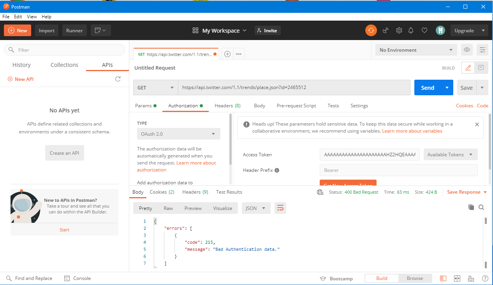
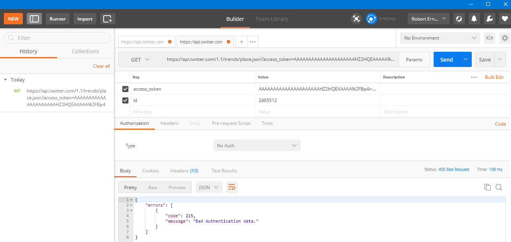
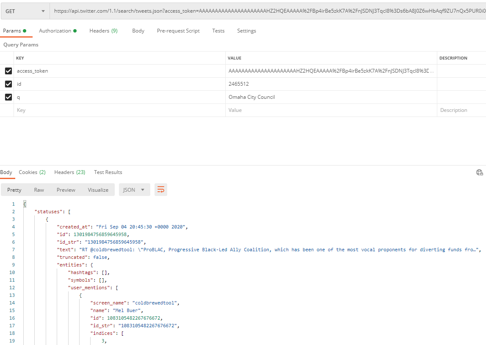
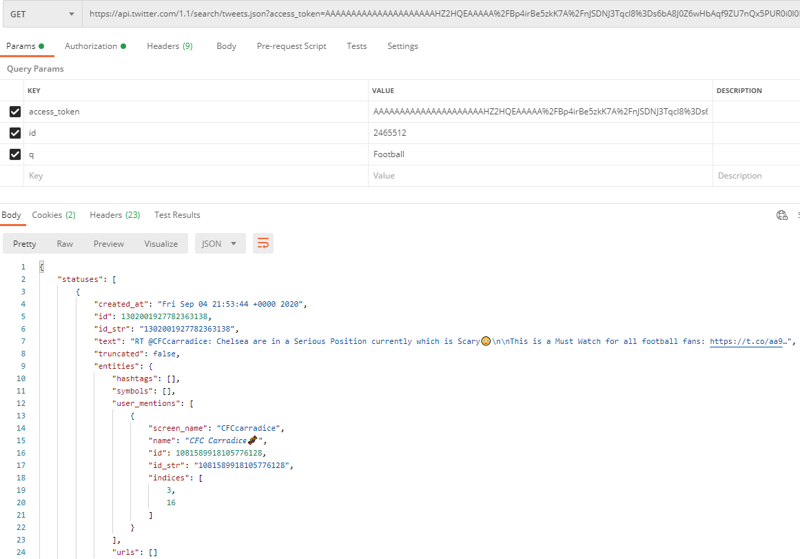
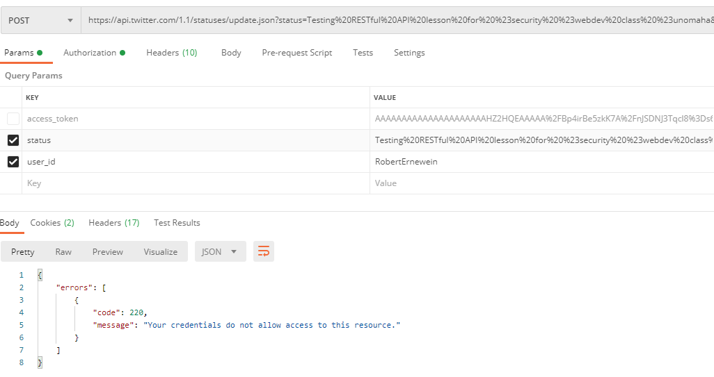
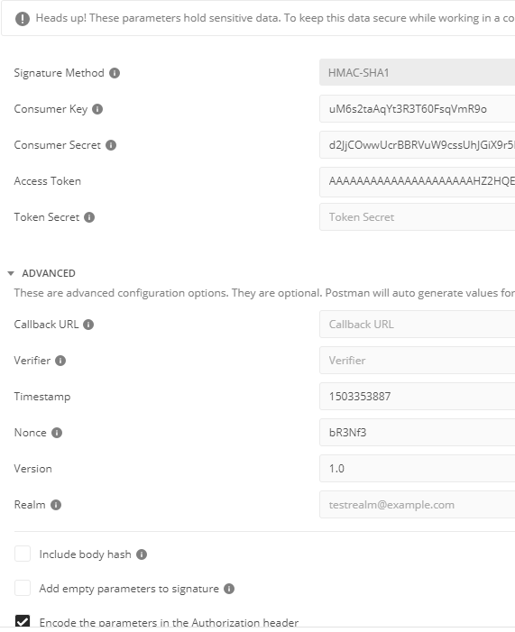

# CYBR8470: Secure Web Application Development
Professor: Dr. Hale
Student:   Robert Ernewein

## Lab 1: RESTFul APIs
Twitter Application: CYBR8470-F20-Lab1


Keys:     Twitter API Keys.txt  
Browser:  Google Chrome (v85.0.4183.83)  
Software: Postman (v7.31.1)

## Screenshots & Findings

### Step 4: GET Requests

4.1: Creating GET request for Twitter Trends


4.2: Getting new Access Token


4.3: Set Authentication Type: OAuth 2.0


4.4: Set Location ID: 2465512 (Omaha, NE)


Note: I had some issues with Postman requiring manual input/configuration of the GET request.



4.5: Local Trending Data 


### Step 5: Addtional GET Requests

Searching recent Tweets via
https://api.twitter.com/search/tweets.json

5.1: Omaha City Council


5.2: High School Football



### Step 6: Post Request



High School Football



```
Testing RESTful API lesson for #security #webdev class #unomaha
```

* Hit the ```send``` button to issue the _POST request_ to the URL.
* What happened?

Notice that the API Resource reference [here](https://dev.twitter.com/rest/reference/post/statuses/update) marks the required authentication with `user context only`. This means that you need to be logged in using that user's context to successfully `POST` as them.

* To do this, we need to switch to `Oauth 1` and provide a user context. Remember that `access token` you generated in Step 3? Now is where it will be useful. Basically, what you did was grant the app you created access to your twitter account. Now we are going to use the token it was given to authorize it to post on your behalf. Usually you would implement a 3 way oauth chain to get this token:

* For now lets use what we have. Visit [https://apps.twitter.com/](https://apps.twitter.com/)
* Click the app you created.
* Now in `POSTMAN` select `Authorization` and then set the type to `Oauth 1`
* Enter your information:

* Click send. You should see a success message now! Check your twitter account:
> !!! Note !!! Depending on your version of postman, you may need to remove the url encoding from your status parameter. Newer versions of POSTMAN URL encode automatically for you. In that case you can just use `Testing RESTful API lesson for #security #webdev class #unomaha` as your status parameter.

> It worked!
