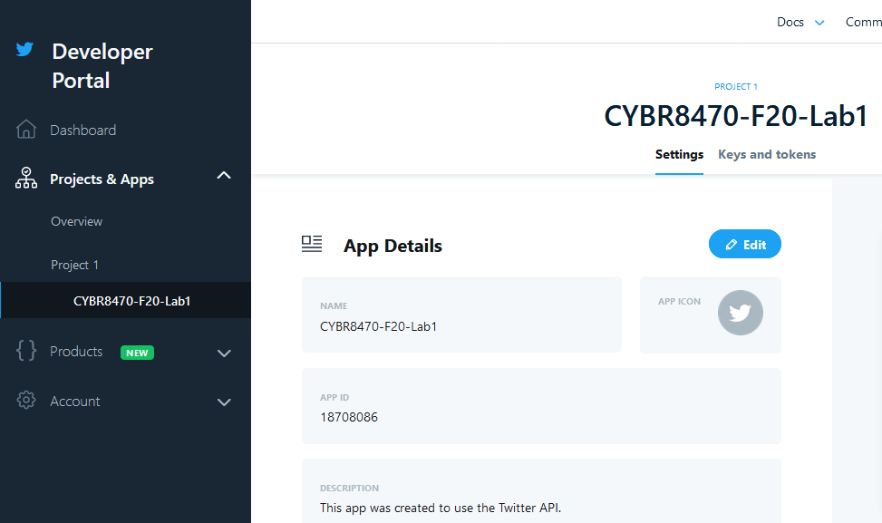
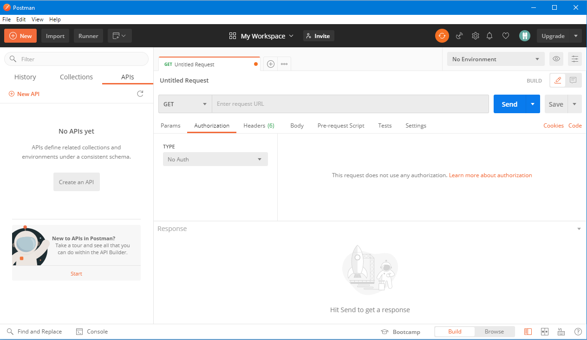
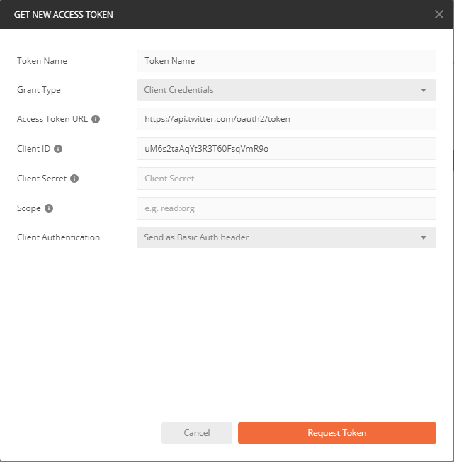
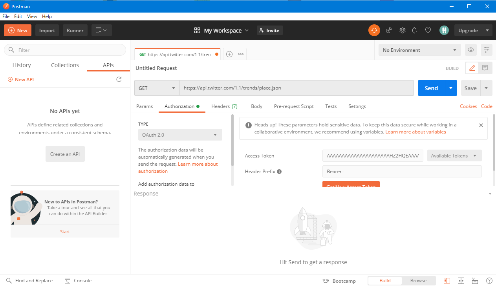
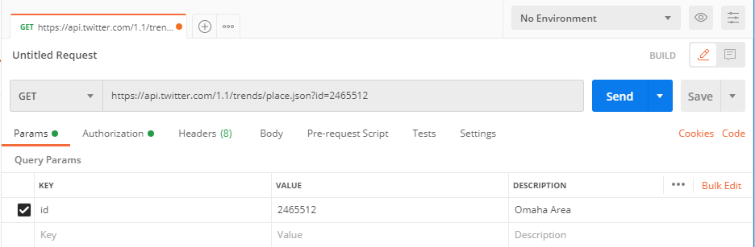
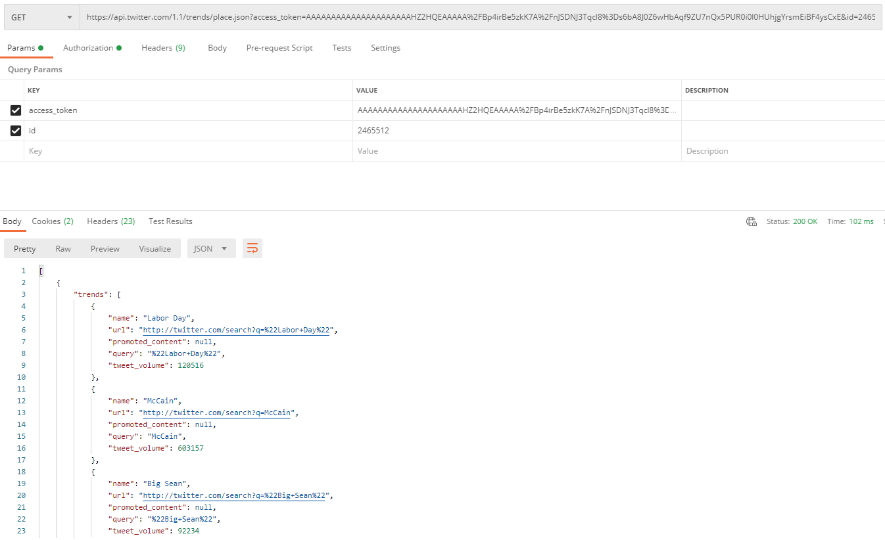

# CYBR8470: Secure Web Application Development
Professor: Dr. Hale
Student:   Robert Ernewein

## Lab 1: RESTFul APIs
Twitter Application: CYBR8470-F20-Lab1


Keys:     Twitter API Keys.txt
Browser:  Google Chrome (v85.0.4183.83)
Software: Postman (v7.31.1)

## Screenshots & Findings

### Step 4: GET requests












* Now that we have a token, you should see that the token has been added as a parameter called `access_token`. Lets add the `id` for Omaha again.

At this point your request should look something like:


* Hit the ```send``` button to issue the _GET request_ to the URL. You should see recent results. In my case I wrote this during the 2017 eclipse and saw the following as the eclipse went through Omaha.


### Step 5: Other GET Requests
Try some other requests using the `search API` on twitter. See: [https://developer.twitter.com/en/docs/tweets/search/api-reference/get-search-tweets](https://developer.twitter.com/en/docs/tweets/search/api-reference/get-search-tweets) for more information about the different options.

Your queries should target [https://api.twitter.com/1.1/search/tweets.json](https://api.twitter.com/1.1/search/tweets.json)

### Step 6: First POST request to create a new tweet
Now that we have the basics of `GET requests` to access tweet data, lets try making a new tweet! We will work with the `API endpoint` here: [https://developer.twitter.com/en/docs/tweets/post-and-engage/api-reference/post-statuses-update](https://developer.twitter.com/en/docs/tweets/post-and-engage/api-reference/post-statuses-update)

Configure a request to [https://api.twitter.com/1.1/statuses/update.json](https://api.twitter.com/1.1/statuses/update.json)

* Make sure to add a `user_id` field corresponding to your twitter user id (shown on the APP page as the `owner id`) and a `status` field which will be the 140 character or less message to post to your account. In my case I'm trying to post to my account `mlhale_` (id: `246485084`) with the status:

```
Testing%20RESTful%20API%20lesson%20for%20%23security%20%23webdev%20class%20%23unomaha
```

Which is a URL encoded (to remove spaces and special characters) of the status:

```
Testing RESTful API lesson for #security #webdev class #unomaha
```


* Hit the ```send``` button to issue the _POST request_ to the URL.
* What happened?


* Twitter restricts the access of `Tokens` to the context that it has access to. Since we are using an `App Key` we do not have access to the user.

Notice that the API Resource reference [here](https://dev.twitter.com/rest/reference/post/statuses/update) marks the required authentication with `user context only`. This means that you need to be logged in using that user's context to successfully `POST` as them.


* To do this, we need to switch to `Oauth 1` and provide a user context. Remember that `access token` you generated in Step 3? Now is where it will be useful. Basically, what you did was grant the app you created access to your twitter account. Now we are going to use the token it was given to authorize it to post on your behalf. Usually you would implement a 3 way oauth chain to get this token:


* For now lets use what we have. Visit [https://apps.twitter.com/](https://apps.twitter.com/)
* Click the app you created.
* Now in `POSTMAN` select `Authorization` and then set the type to `Oauth 1`
* Enter your information:


* Click send. You should see a success message now! Check your twitter account:
> !!! Note !!! Depending on your version of postman, you may need to remove the url encoding from your status parameter. Newer versions of POSTMAN URL encode automatically for you. In that case you can just use `Testing RESTful API lesson for #security #webdev class #unomaha` as your status parameter.


> It worked!
